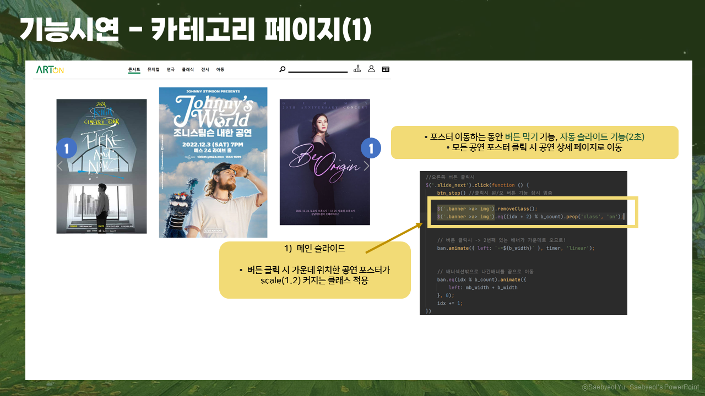
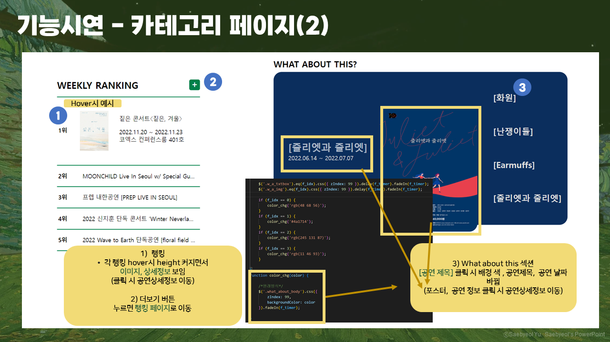
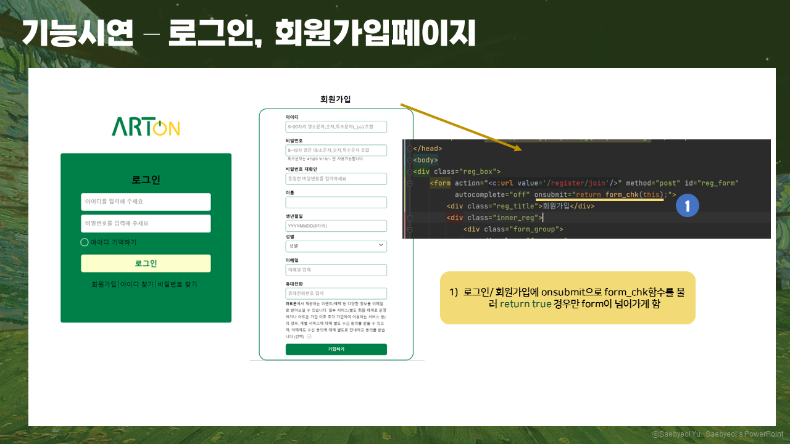
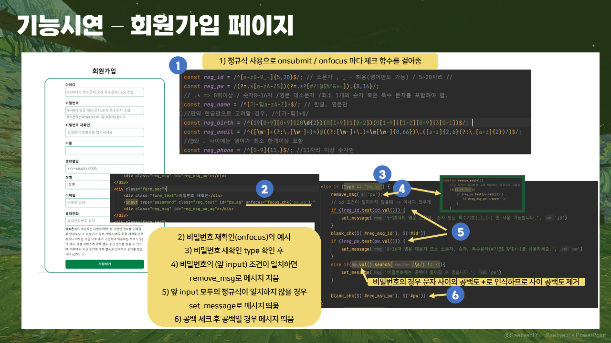
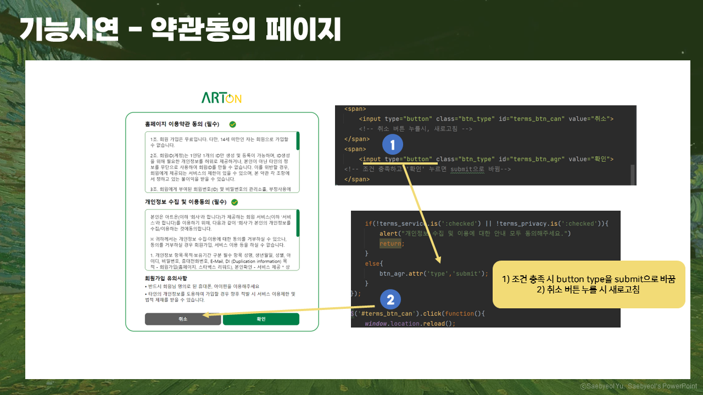
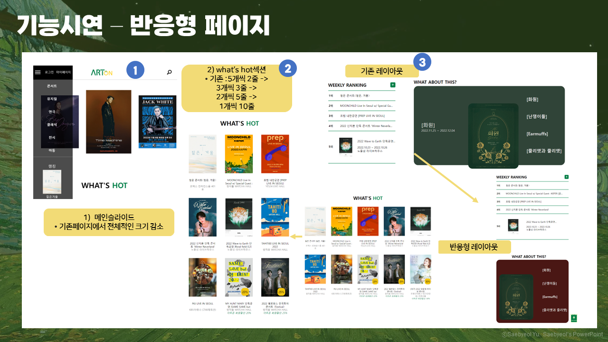

# ARTON_Gyenogmi

아트온 페이지\_ 개인 백업본입니다.

# 아트온

   
  
   

## 프로젝트 일정 및 전체정리(노션)

[![notion]](https://harmless-patio-fe8.notion.site/ARToN-6b34bf3422d541c5aaa228600b7bb4aa)
(클릭시 노션 페이지로 이동)
 

## 프로젝트 목표

직관적으로 공연 정보를 확인할 수 있고, 구매가 편리한 공연 티켓 판매 사이트 구현

 

## 프로젝트 기간

2022년 11월 29일 ~ 2022년 12월 8일

 

## 팀 개발 환경

  - <b>운영체제</b>	: Window
   
- <b>개발도구</b>	: Visual Studio Code, Intellij, Oven(카카오 Prototyping tool)
   
- <b>DBMS</b>	: Mysql
   
- <b>Server</b> : Apache Tomcat 9.0.68
   
- <b>Language</b>: Html5, CSS3, JavaScript, JQuery, Jstl, JSP
   
- <b>FrameWork</b>: Spring
   
- <b>버전관리 시스템</b>	: git(Github Desktop)
   

 

## 나의 기술 스택

| JavaScript/JQuery |  HTML   |  CSS   |
| :---------------: | :-----: | :----: |
|       ![js]       | ![html] | ![css] |

 

## 구현 기능

### 기능 1

   
  
   

### 기능 2

   
    
   

### 기능 3

   
  
   

### 기능 4

   
  
   

### 기능 5

   
  
   

### 기능 6

   
  
   
  
 

## 라이센스

MIT &copy; [NoHack](mailto:lbjp114@gmail.com)

<!-- Stack Icon Refernces -->

[js]: ./images/stack/javascript.svg
[jquery]: ./images/stack/jquery.PNG
[html]: ./images/stack/html.svg
[css]: ./images/stack/css.svg
[notion]: ./images/stack/notion.svg
